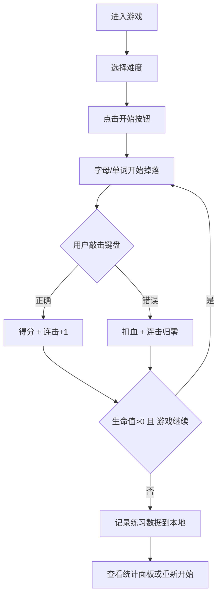

## 1. 产品概述
键盘指法练习游戏，帮助用户提升打字速度和准确率。通过从屏幕顶部掉落的字母/单词，用户需及时敲击对应按键完成挑战。
- 核心目标：通过游戏化方式训练键盘指法，记录每日练习数据并追踪进步
- 目标用户：需要提升打字能力的学生、程序员、办公人员等

## 2. 核心功能

### 2.1 用户角色
| 角色 | 注册方式 | 核心权限 |
|------|----------|----------|
| 普通用户 | 无需注册，本地存储 | 使用全部功能、保存练习记录、自定义词库 |

### 2.2 功能模块
1. **游戏主页面**：掉落字母/单词、得分系统、生命值、虚拟键盘、连击显示
2. **难度选择**：简单（单字母）、普通（短单词）、困难（长单词）
3. **词库编辑器**：JSON格式上传/下载、预览词库、恢复默认
4. **统计面板**：每日练习时长、正确率、折线图展示

### 2.3 页面详情
| 页面名称 | 模块名称 | 功能描述 |
|----------|----------|----------|
| 游戏主页面 | 游戏区域 | 字母/单词从顶部掉落，根据难度不同速度和内容变化 |
| 游戏主页面 | 状态栏 | 显示分数、生命值、当前难度、连击数、最高连击 |
| 游戏主页面 | 虚拟键盘 | 背景层显示完整键盘布局，按键按下时高亮 |
| 游戏主页面 | 控制按钮 | 开始/暂停、重新开始、难度切换、打开词库编辑器、查看统计 |
| 词库编辑器弹窗 | 词库管理 | JSON上传/下载、词库预览、分类标签（字母/短词/长词） |
| 统计面板弹窗 | 数据展示 | 最近7天/30天练习时长和正确率的折线图 |

## 3. 核心流程
用户进入游戏 → 选择难度 → 点击开始 → 字母/单词掉落 → 敲击键盘输入 → 正确得分+连击+1，错误扣血+连击归零 → 生命值为0或用户停止 → 记录本次数据 → 查看统计

## 4. 用户界面设计

### 4.1 设计风格
- **主色调**：深色主题（#0f172a 深蓝黑背景），搭配霓虹色（#22d3ee 青色、#a855f7 紫色、#f472b6 粉色）作为强调色
- **按钮风格**：圆角胶囊按钮，带发光边框效果，悬停时有轻微放大动画
- **字体**：主字体使用 JetBrains Mono（等宽编程字体，适合打字练习），标题字体使用 Space Grotesk
- **布局风格**：全屏沉浸式布局，游戏区域居中，状态栏顶部横向排列，虚拟键盘底部半透明显示
- **视觉效果**：掉落元素带发光尾迹，按键高亮带脉冲动画，得分飘字效果

### 4.2 页面设计概览
| 页面名称 | 模块名称 | UI元素 |
|----------|----------|--------|
| 游戏主页面 | 状态栏 | 横向排列的6个数据卡片：分数、生命、难度、当前连击、最高连击、用时 |
| 游戏主页面 | 掉落区域 | 深色渐变背景，字母/单词白色发光文字，正确命中绿色爆炸效果，错误红色闪烁 |
| 游戏主页面 | 虚拟键盘 | 底部固定，半透明深色背景，标准QWERTY布局，按键圆角矩形，按下时发光高亮 |
| 游戏主页面 | 控制面板 | 底部右侧浮动按钮组：开始/暂停、重开、难度选择、词库、统计 |
| 词库编辑器 | 弹窗 | 三列布局：左侧分类标签、中间JSON编辑器、右侧预览列表 |
| 统计面板 | 弹窗 | 上方选项卡（时长/正确率），中间SVG折线图，下方数据汇总卡片 |

### 4.3 响应式
- Desktop优先设计，最小支持宽度1024px
- 移动端：虚拟键盘缩小，状态栏改为两行布局
- 触摸设备：支持虚拟键盘点击操作

### 4.4 动画设计
- 掉落元素：使用CSS动画实现带重力感的下落轨迹
- 命中效果：粒子爆炸 + 缩放消失
- 按键反馈：按下时缩放0.95 + 发光扩散
- 分数飘字：向上飘动 + 渐隐
- 连击里程碑（10/25/50/100）：全屏闪光特效
