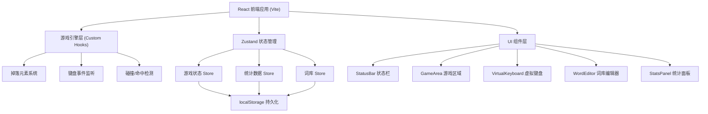

## 1. 架构设计



## 2. 技术说明
- **前端框架**: React 18 + TypeScript
- **构建工具**: Vite 5
- **样式方案**: TailwindCSS 3
- **状态管理**: Zustand 4
- **路由**: React Router DOM 6（单页应用，主要做弹窗路由）
- **图表**: 自实现 SVG 折线图（无需额外依赖）
- **图标**: lucide-react
- **数据持久化**: localStorage

## 3. 路由定义
| 路由 | 用途 |
|------|------|
| / | 游戏主页面 |

所有功能模块通过弹窗/抽屉组件实现，无需多页面路由。

## 4. 数据模型

### 4.1 游戏状态 (GameState)
```typescript
interface GameState {
  status: 'idle' | 'playing' | 'paused' | 'gameover';
  difficulty: 'easy' | 'normal' | 'hard';
  score: number;
  lives: number;
  maxLives: number;
  combo: number;
  maxCombo: number;
  startTime: number | null;
  totalTime: number;
  correctCount: number;
  wrongCount: number;
  fallingItems: FallingItem[];
}

interface FallingItem {
  id: string;
  text: string;
  typed: string;
  x: number;
  y: number;
  speed: number;
  createdAt: number;
}
```

### 4.2 词库数据 (WordLibrary)
```typescript
interface WordLibrary {
  easy: string[];      // 单字母 A-Z
  normal: string[];    // 短单词 3-5 字母
  hard: string[];      // 长单词 6+ 字母
}
```

### 4.3 统计数据 (DailyStats)
```typescript
interface DailyStats {
  date: string;              // YYYY-MM-DD
  totalDuration: number;     // 秒
  correctCount: number;
  wrongCount: number;
  accuracy: number;          // 0-1
  sessions: number;
}
```

### 4.4 Zustand Stores
```typescript
// useGameStore - 游戏核心状态
// useWordStore - 词库管理
// useStatsStore - 统计数据持久化
```

## 5. 核心模块说明

### 5.1 游戏循环 (useGameLoop)
- 使用 `requestAnimationFrame` 实现流畅的动画循环
- 每一帧更新所有掉落元素的 y 坐标
- 检测元素是否触底（未输入则扣血）
- 根据难度控制生成新元素的频率

### 5.2 键盘输入 (useKeyboard)
- 全局监听 `keydown` 事件
- 匹配当前激活的掉落元素（最下方的）
- 逐字符匹配输入进度
- 触发虚拟键盘高亮效果

### 5.3 难度配置
```typescript
const DIFFICULTY_CONFIG = {
  easy:   { spawnInterval: 2000, baseSpeed: 0.8,  wordPool: 'easy'   },
  normal: { spawnInterval: 1500, baseSpeed: 1.2,  wordPool: 'normal' },
  hard:   { spawnInterval: 1000, baseSpeed: 1.8,  wordPool: 'hard'   }
};
```

### 5.4 得分规则
- 正确输入一个字符：+10 分
- 连击加成：每 5 连击额外 +50% 分数
- 完成整个单词：单词长度 × 20 额外奖励
- 错误输入：扣 1 生命值，连击归零
- 掉落触底：扣 1 生命值

## 6. 文件结构
```
src/
├── components/
│   ├── StatusBar.tsx         # 顶部状态栏
│   ├── GameArea.tsx          # 游戏掉落区域
│   ├── FallingItem.tsx       # 单个掉落元素
│   ├── VirtualKeyboard.tsx   # 虚拟键盘
│   ├── ControlPanel.tsx      # 控制按钮组
│   ├── WordEditor.tsx        # 词库编辑器弹窗
│   ├── StatsPanel.tsx        # 统计面板弹窗
│   ├── LineChart.tsx         # SVG 折线图组件
│   └── Modal.tsx             # 通用弹窗组件
├── hooks/
│   ├── useGameLoop.ts        # 游戏循环 Hook
│   ├── useKeyboard.ts        # 键盘输入 Hook
│   └── useFallingSpawner.ts  # 掉落生成器 Hook
├── stores/
│   ├── useGameStore.ts       # 游戏状态
│   ├── useWordStore.ts       # 词库数据
│   └── useStatsStore.ts      # 统计数据
├── utils/
│   ├── constants.ts          # 常量配置
│   ├── defaultWords.ts       # 默认词库
│   └── storage.ts            # localStorage 封装
├── types/
│   └── index.ts              # TypeScript 类型定义
├── App.tsx
├── main.tsx
└── index.css
```
